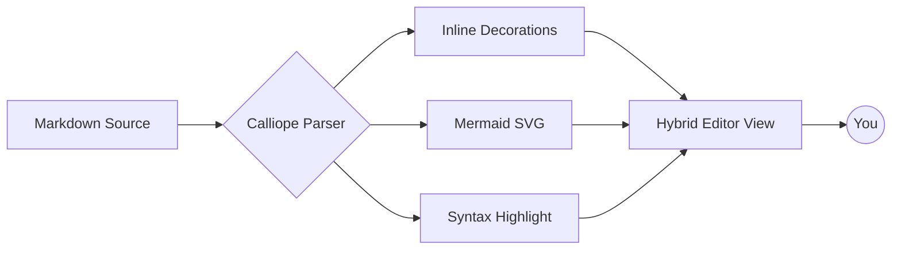
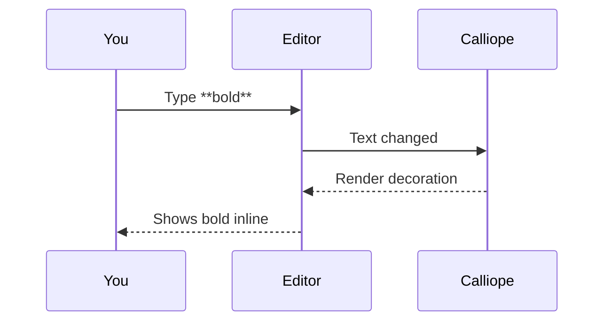

# Calliope — Write Markdown, See It Live

Write in Markdown. **See it rendered inline.** Syntax stays out of your way until you need it — then it gracefully reappears at your cursor.

> *"Named after Calliope (Καλλιόπη), the Greek Muse of eloquence and epic poetry — she of the beautiful voice."*

---

## Text Formatting Renders Inline

This is **bold text**, this is *italic*, and this is ***bold italic***. You can also ~~strike text through~~ for revisions. Inline `code snippets` get a subtle background, and typed code like `ts:const port: number = 3000` gets full **TypeScript syntax highlighting** right inside your prose.

Visit the [project on GitHub](https://github.com/gAmUssA/calliope-md) — the URL stays hidden until your cursor lands on the link. Ctrl+Click to open.

## Task Lists You Can Click

- [x] Inline rendering of Markdown elements
- [x] Three-state visibility (rendered / ghost / raw)
- [x] Zero document modification — pure visual decorations
- [x] Mermaid diagrams rendered as live SVG
- [ ] Click any checkbox to toggle it instantly
- [ ] Tables with hidden pipe delimiters
- [ ] Presentation Mode for live demos

## Code Blocks with Syntax Highlighting

```typescript
interface Decoration {
  range: vscode.Range;
  renderOptions: vscode.DecorationRenderOptions;
}

function renderHeading(line: string, level: number): Decoration {
  return {
    range: new vscode.Range(0, 0, 0, line.length),
    renderOptions: { before: { contentText: line, fontWeight: 'bold' } }
  };
}
```

```python
def calliope(text: str) -> str:
    """The Muse of eloquence."""
    return text.strip().replace("**", "")
```

## Mermaid Diagrams Render as Live SVG





## Tables Without the Noise

| Element       | Markdown      | Rendered Output          |
|---------------|---------------|--------------------------|
| Heading       | `# Title`     | **Title** (larger, bold) |
| Bold          | `**text**`    | **text**                 |
| Italic        | `*text*`      | *text*                   |
| Strikethrough | `~~text~~`    | ~~text~~                 |
| Inline code   | `` `code` ``  | `code`                   |
| Task (open)   | `- [ ] todo`  | ☐ todo                   |
| Task (done)   | `- [x] done`  | ☑ ~~done~~               |
| Link          | `[text](url)` | [text](#) (URL hidden)   |

## Blockquotes & Lists

> **Distraction-free writing.** Markers fade when reading, ghost when nearby, and snap back the moment you click into them.
>
> No more flipping between source and preview panes.

### Unordered

- Headers, bold, italic — all rendered in place
- Three-state visibility for syntax markers
  - Rendered when cursor is elsewhere
  - Ghost (30% opacity) when cursor is on the line
  - Raw markdown when cursor is *inside* the marker
- Click-through task checkboxes

### Ordered

1. Open any `.md` file in VS Code
2. Calliope decorates it instantly
3. Start typing — your source stays pristine

---

## Inline Images


## Settings at a Glance

| Setting                          | Default | Purpose                            |
|----------------------------------|---------|------------------------------------|
| `calliope.enabled`               | `true`  | Master toggle                      |
| `calliope.ghostOpacity`          | `0.3`   | Opacity of ghosted syntax          |
| `calliope.renderMermaidDiagrams` | `false` | **[Experimental]** live SVG render |
| `calliope.renderTables`          | `false` | **[Experimental]** clean tables    |

## Commands

- `Calliope: Toggle Inline Rendering` — full on/off
- `Calliope: Toggle Task Checkbox` — flip the box at the cursor
- `Calliope: Toggle Presentation Mode` — clean demo view
- `Calliope: One Sentence Per Line` — reformat prose for cleaner diffs
- `Calliope: Format Tables` — auto-align column widths

---

> **Philosophy:** *Never modify the document.* All rendering is purely visual via decorations. Your undo history, git diffs, and source file remain untouched.

*Install from the **VS Code Marketplace** — search for "Calliope".*
