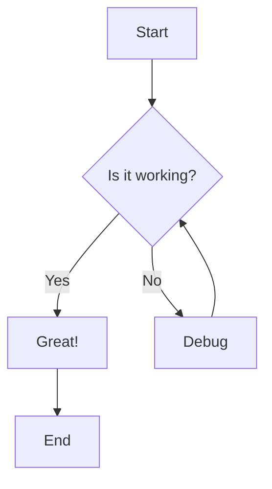
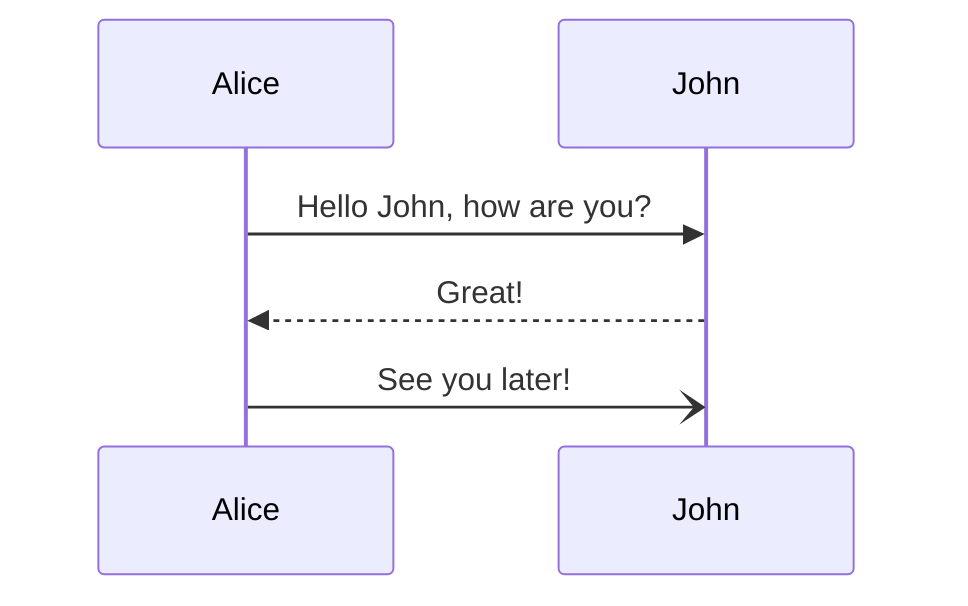

# Heading 1

This is a paragraph under heading 1.

## Heading 2

### Heading 3

#### Heading 4

##### Heading 5

###### Heading 6

## Text Formatting

This is **bold text** and this is *italic text* and this is ***bold italic***.

This has ~~strikethrough~~ text.

You can also use __bold__ and _italic_ with underscores.

## Task Lists

- [ ] Uncompleted task should show checkbox
- [x] Completed task should show checked box AND strikethrough
- [ ] Another uncompleted task
- [x] Another completed task with strikethrough
- [ ] Task with **bold** and `code` inside
- [x] ~~Completed~~ task that is **also bold**

## Links and Code

Here's a [link to Google](https://google.com) that should be clickable.

Another [link to GitHub](https://github.com) for testing.

Here's some `inline code` with background.

More `code examples` to test.

## Complex Nesting

This paragraph has **bold with *nested italic* inside** and also `code`.

A [link with **bold** text](https://example.com) inside.

## Long Content for Scroll Testing

Lorem ipsum dolor sit amet, consectetur adipiscing elit. Sed do eiusmod tempor incididunt ut labore et dolore magna aliqua.

Ut enim ad minim veniam, quis nostrud exercitation ullamco laboris nisi ut aliquip ex ea commodo consequat.

Duis aute irure dolor in reprehenderit in voluptate velit esse cillum dolore eu fugiat nulla pariatur.

Excepteur sint occaecat cupidatat non proident, sunt in culpa qui officia deserunt mollit anim id est laborum.

## Another Section

More content here to test scrolling and viewport-aware rendering.

- [ ] Task at the bottom
- [x] Completed task at the bottom
- [ ] One more task

The end of the test file.

---

## Phase 2 Elements

### Blockquotes

> This is a simple blockquote.
> It spans multiple lines.

> Blockquote with **bold** and *italic* text.

> Nested blockquote:
> > This is nested inside another blockquote.

### Horizontal Rules

Three dashes:

---

Three asterisks:

***

Three underscores:

___

### Fenced Code Blocks

```javascript
function hello() {
  console.log("Hello, World!");
  return 42;
}
```

```python
def greet(name):
    print(f"Hello, {name}!")
```

```
Plain code block without language
```

### Mermaid Diagrams (Experimental - Enable with calliope.renderMermaidDiagrams)

Simple flowchart:



Sequence diagram:



### Images


### Lists

Unordered lists:

- First item
- Second item
  - Nested item
  - Another nested item
- Third item

Alternative markers:

* Star marker
* Another star

+ Plus marker
+ Another plus

Ordered lists:

1. First ordered item
2. Second ordered item
3. Third ordered item

Mixed nesting:

1. First ordered
   - Unordered inside
   - Another unordered
2. Second ordered
   1. Nested ordered
   2. More nested


### Tables

Simple table:

| Name | Age | City |
|------|-----|------|
| Alice | 30 | NYC |
| Bob | 25 | LA |
| Carol | 35 | Chicago |

Table with alignment:

| Left | Center | Right |
|:-----|:------:|------:|
| L1 | C1 | R1 |
| L2 | C2 | R2 |

Table with inline formatting:

| Scenario | Description |
|----------|-------------|
| `NORMAL_TRAFFIC` | 60% deposits, 40% withdrawals, amounts $10-$1000 |
| `HIGH_VOLUME` | Fast generation, varied amounts |
| `INSUFFICIENT_FUNDS` | 20% deposits, 80% withdrawals (triggers failures) |
| `FRAUD_DETECTION` | High-velocity patterns, large withdrawals |

Single-row table:

| Header 1 | Header 2 |
|----------|----------|
| Only row | Data here |

