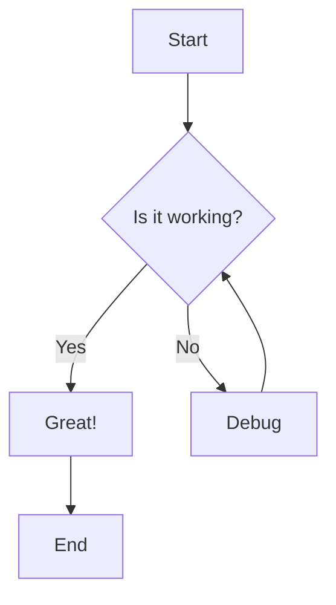
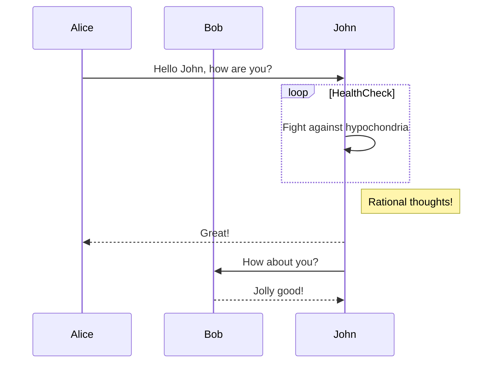
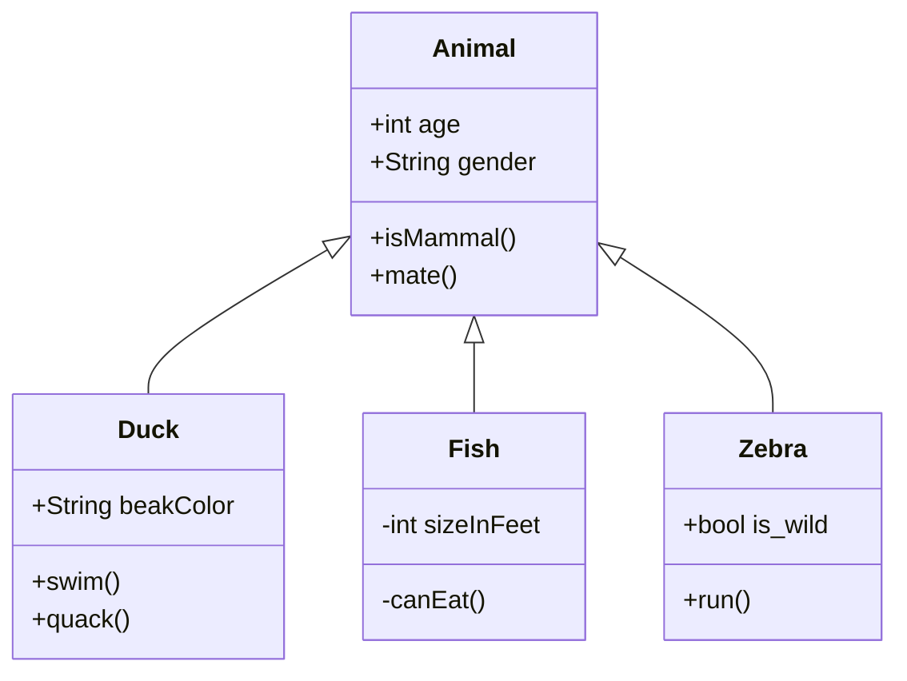
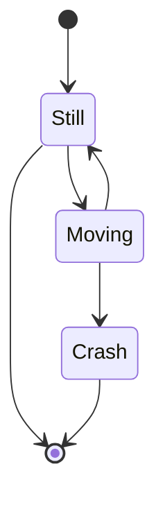
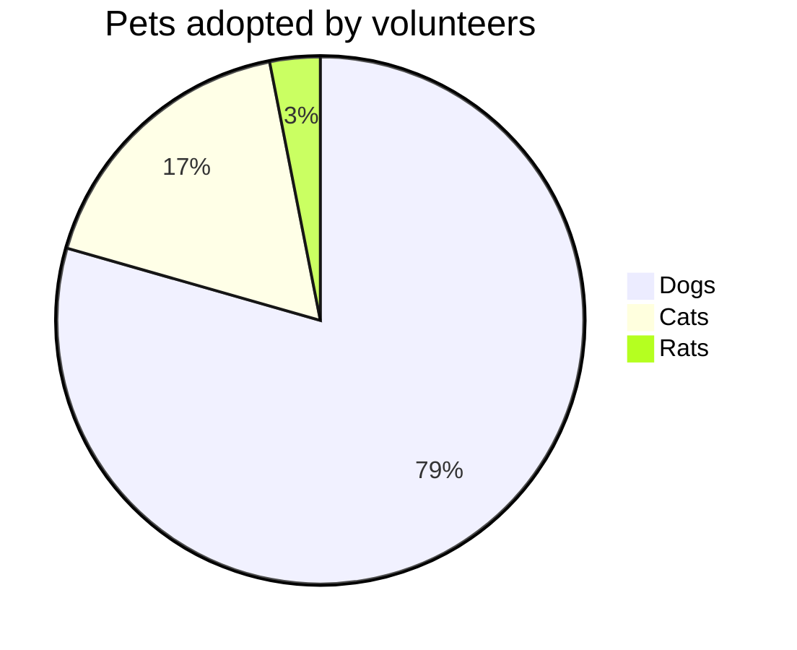

# Mermaid Diagram Test

This file tests various mermaid diagram types for the Calliope inline rendering feature.

## Flowchart



## Sequence Diagram



## Class Diagram



## State Diagram



## Invalid Syntax Test

```mermaid
this is not valid mermaid syntax
it should show an error indicator
```

## Regular Code Block (Should Not Render)

```javascript
console.log("This is regular JavaScript");
console.log("Should render as normal code block");
```

## Another Mermaid - Pie Chart


